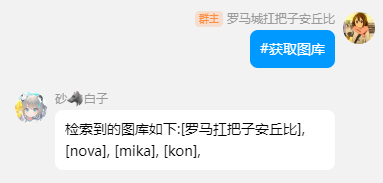

# [「来只」插件](https://github.com/cssxsh/pixiv-helper)

> 基于 Mirai QQ机器人的发图插件

:warning:  **本插件没有配置文件** 
## 主要功能 ：关键字触发发图

无需配置，直接扔进 `bot/plugins` 即可使用

**分群存储**：不同的群组存储不同的群友图片，支持多群，再也不用担心隔壁的se图泄露了 

**开关检索**：添加了开关关键字的指令，可以在指令触发和直接触发中选择

**获取列表**：获取图片列表，可以通过文字和图片两种方式获取，查询群友存了什么草图

### :pencil: 具体食用方法:

当你发送`来只 AAAAAA` 时 ，插件会从本地存储的 *AAAAAA* 文件夹中取出图片

在群里发送 `开关关键字` ，机器人会倒置当前状态。 
关闭=>开启/开启=>关闭

在群里发送 `/获取图库` 机器人会返回一张渲染好的图片列表

如果发送的是 `#获取图库` 返回的是文字列表

当开关关键字=true时， 只要聊天中出现了关键字就会自动触发。

